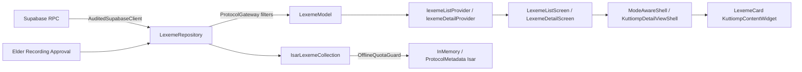

# Tribal Maintainer Guide – Lexeme Module

**Onboarding target:** one hour (Protocol 12)  
**Constitution:** Kuttiomp Master Architecture Document v2.0, §§4, 6, 7, 2, 9

---

## Directory Map (§4)

```
features/lexeme/
├── data/
│   ├── lexeme_repository.dart      # AuditedRepository + RPC-only access
│   └── isar_lexeme_collection.dart # Offline mirror + quota + sacred consent
├── domain/
│   ├── lexeme_model.dart           # Governed immutable model (all protocol fields)
│   └── lexeme.dart                 # Barrel export
└── presentation/
    ├── lexeme_card.dart            # KuttiompContentWidget list/detail card
    ├── lexeme_list_screen.dart     # ModeAwareShell.forContentList
    ├── lexeme_detail_screen.dart   # KuttiompDetailViewShell + protocol widgets
    └── lexeme_mastery_petal.dart   # Dashboard six-stage mastery petal
```

**Providers:** `core/di/lexeme_providers.dart`  
**Routes:** `/lexemes`, `/lexeme/:id`

---

## Data Flow Diagram



---

## Protocol Field Cross-Reference

| Field | Protocol | Location |
|-------|----------|----------|
| `speakerMetadata` / `speaker_id` | P1 | `lexeme_model.dart`, `LexemeCard` |
| `elderApproved` / `approvalChain` | P2 | model + `ApprovedContentGate` |
| `visibleToTiers` | P3 | model + `TierAwarePage` / `ModeTierGuard` |
| `sacredFlag` / `encryptedSacredPayload` | P4 | model + `SacredContentLockerWidget` |
| `clanScope` | P5 | model + `ProtocolGateway.isClanPermitted` |
| `geoContext` / `seasonalWindow` | P6 | model + `GeoContextBadge` |
| `primaryAudioId` | P7 | model + `OralFirstPlayer` |
| `authoritySource` | P8 | model + `AuthorityBadge` |
| `AuditedRepository` / audit log | P9 | `lexeme_repository.dart` |
| No gamification in cards | P10 | design_system dignity |
| `fontSize` in `toContentContext` | P11 | mode + theme extension |
| `schemaVersion` | P12 | model + compliance tests |

---

## One-Hour Onboarding Path

1. **Read** `domain/lexeme_model.dart` (15 min) — all protocol fields.
2. **Trace** `data/lexeme_repository.dart` (15 min) — RPC + offline fallback.
3. **Trace** UI flow (15 min): petal → list → detail with guard stack.
4. **Run tests** (15 min):

```bash
cd apps/mobile
flutter test test/features/lexeme/lexeme_protocol_compliance_test.dart
flutter test test/offline/lexeme_offline_sync_test.dart
flutter test test/features/lexeme/
```

---

## Tribal Edit Instructions

| Task | File to edit |
|------|--------------|
| Add offline seed word | `lexeme_repository.dart` → `_offlineCorpus` |
| Change tier filter | `lexeme_repository.dart` → `_isPermitted` |
| Adjust list UI | `lexeme_list_screen.dart` |
| Adjust detail guards | `lexeme_detail_screen.dart` + `detail_view_shell.dart` |
| Dashboard mastery label | `lexeme_mastery_petal.dart` |
| Offline quota | `core/offline/offline_quota_guard.dart` |

**Never:** bypass `ProtocolGateway`, call Supabase tables directly, or render without `KuttiompContentWidget`.

---

**(Protocol 12 compliance verified)**